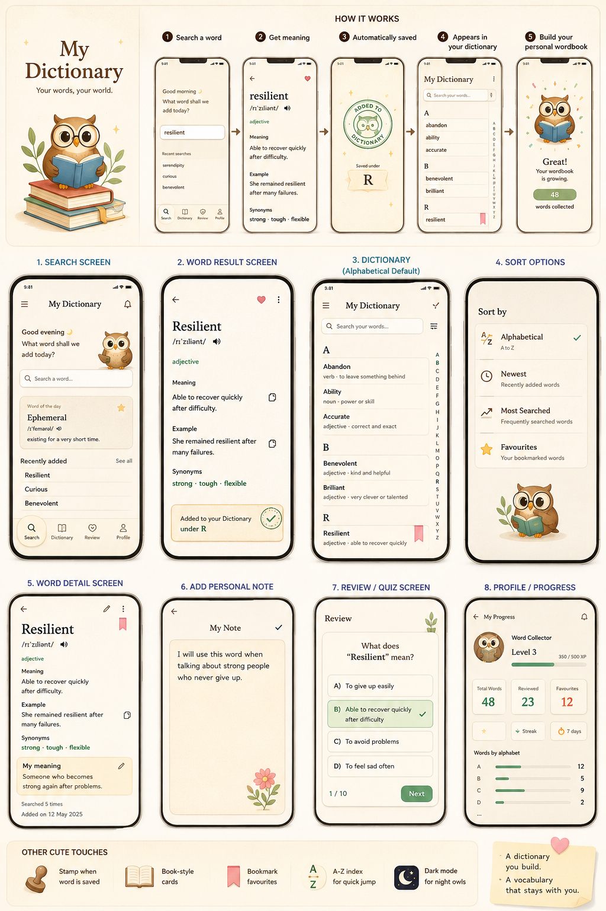

# My Dictionary

A cross-platform dictionary and vocabulary learning app built with Expo, React Native, and TypeScript. Search for English words, save them to a personal dictionary, add notes, sort your saved words, and review vocabulary with a quiz-style flow.



## Features

- Search English words using the public [Dictionary API](https://dictionaryapi.dev/)
- Save words to a personal dictionary
- View definitions, examples, synonyms, antonyms, phonetics, and audio links when available
- Add personal notes and custom meanings
- Mark words as favourites
- Sort and browse saved words alphabetically or by learning metadata
- Review saved words with quiz-style practice
- Profile screen with learning progress stats
- Responsive layout for mobile, tablet, desktop, and web
- Local persistence with AsyncStorage

## Tech Stack

- [Expo](https://expo.dev/)
- [React Native](https://reactnative.dev/)
- [React](https://react.dev/)
- [TypeScript](https://www.typescriptlang.org/)
- [React Native Web](https://necolas.github.io/react-native-web/)
- [Playwright](https://playwright.dev/) for end-to-end tests

## Getting Started

### Prerequisites

Install the following before running the project:

- Node.js
- npm
- Expo Go app on your phone, or an Android/iOS simulator

### Installation

```bash
git clone https://github.com/Tanukohli09/my_dictionary.git
cd my_dictionary
npm install
```

### Run the app

Start the Expo development server:

```bash
npm start
```

Run on specific platforms:

```bash
npm run android
npm run ios
npm run web
```

## Available Scripts

```bash
npm start
```

Start the Expo development server.

```bash
npm run android
```

Start the app on Android.

```bash
npm run ios
```

Start the app on iOS.

```bash
npm run web
```

Start the web version.

```bash
npm run typecheck
```

Run TypeScript type checking.

```bash
npm run test:navigation
```

Run the Playwright navigation test suite.

## Project Structure

```text
.
├── App.tsx
├── app.json
├── e2e/                    # Playwright end-to-end tests
├── src/
│   ├── assets/             # App images and illustrations
│   ├── components/         # Reusable UI components
│   ├── data/               # Demo/seed word data
│   ├── hooks/              # Custom React hooks
│   ├── models/             # TypeScript domain models
│   ├── modules/            # Dictionary, review, and saved-word logic
│   ├── navigation/         # App navigation state and flow
│   ├── screens/            # App screens
│   ├── services/           # API and persistence services
│   ├── theme/              # Colors, spacing, typography, breakpoints
│   └── utils/              # Shared utility functions
├── package.json
└── tsconfig.json
```

## Notes

- Word lookup depends on the external Dictionary API, so internet access is required for searching new words.
- Saved words and onboarding state are stored locally on the device/browser.
- Generated folders such as `node_modules`, `.expo`, logs, test results, and screenshots are ignored by git.

## License

This project is currently private/personal and does not specify an open-source license.
