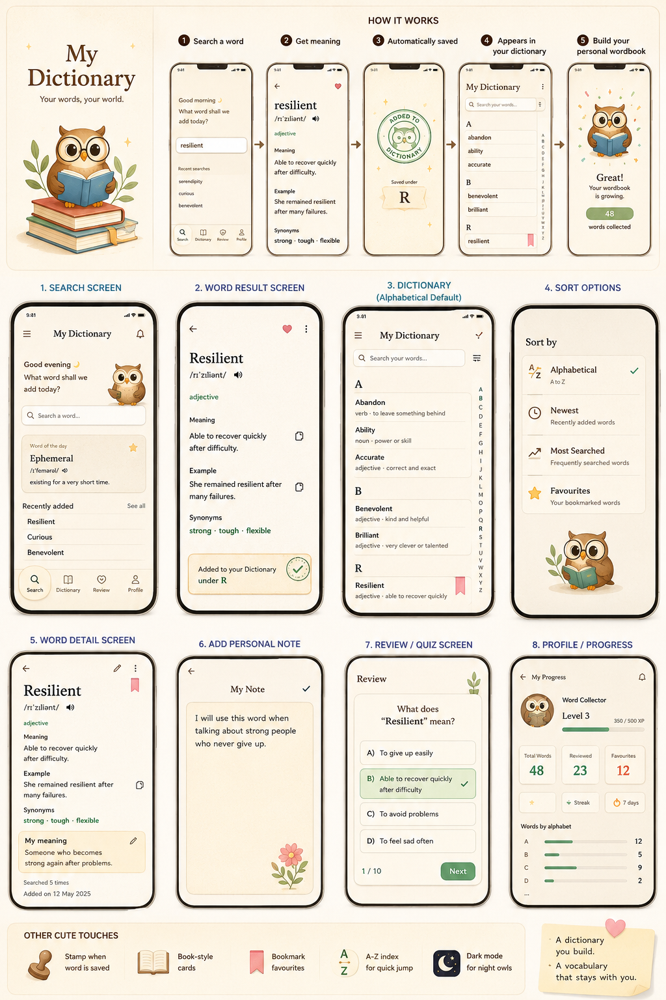

# My Dictionary

A cross-platform dictionary and vocabulary learning app built with Expo, React Native, and TypeScript. Search for English words, save them to a personal dictionary, add notes, sort your saved words, and review vocabulary with a quiz-style flow.



## Features

- Search English words through a configurable dictionary provider
- Save words to a personal dictionary
- View definitions, examples, synonyms, antonyms, phonetics, and audio links when available
- Add personal notes and custom meanings
- Mark words as favourites
- Sort and browse saved words alphabetically or by learning metadata
- Review saved words with quiz-style practice
- Profile screen with learning progress stats
- Responsive layout for mobile, tablet, desktop, and web
- Day/night mode with a persisted theme toggle
- Local persistence with AsyncStorage

## Tech Stack

- [Expo SDK 57](https://expo.dev/sdk/57)
- [React Native](https://reactnative.dev/)
- [React](https://react.dev/)
- [TypeScript](https://www.typescriptlang.org/)
- [React Native Web](https://necolas.github.io/react-native-web/)
- [Playwright](https://playwright.dev/) for end-to-end tests

## Getting Started

### Prerequisites

Install the following before running the project:

- Node.js 18 or newer
- npm
- Expo Go app on your phone, or an Android/iOS simulator

### Installation

```bash
git clone https://github.com/Tanukohli09/my_dictionary.git
cd my_dictionary
npm install
```

### Run the app

Start the web app and its local dictionary proxy:

```bash
npm run web
```

For the browser app, use `npm run web` so the local dictionary proxy starts alongside Expo. Native builds use the public provider by default; set `EXPO_PUBLIC_DICTIONARY_API_URL` to use your hosted proxy instead.

Run on specific platforms:

```bash
npm run android
npm run ios
npm run web
```

### Production deployment

The app is designed to use a real dictionary provider for every new lookup. The default provider is the public [Datamuse API](https://www.datamuse.com/api/) with a [Wiktionary](https://en.wiktionary.org/) fallback. The backend normalizes both responses into the format used by the app. The original [Free Dictionary API](https://dictionaryapi.dev/) remains available by setting `DICTIONARY_PROVIDER=dictionaryapi`.

For a single-server deployment:

1. Copy `.env.example` to your deployment environment and set `EXPO_PUBLIC_DICTIONARY_API_URL=/api/dictionary`.
2. Build the Expo web bundle with `npm run build:web`.
3. Set `NODE_ENV=production`, `DICTIONARY_ENV=production`, and `DICTIONARY_ALLOWED_ORIGIN` to the exact HTTPS website origin. Production startup rejects wildcard CORS.
4. Set `DICTIONARY_PROVIDER_APPROVED=true` only after the selected provider’s quality, quota, terms, licensing, and attribution policy has been reviewed.
5. Start the production server with `npm run start:prod`.
6. Publish the server on `PORT` and set `HOST=0.0.0.0` in the hosting environment.

The production server serves the exported web app, exposes `/api/dictionary/:word`, caches successful lookups, deduplicates simultaneous requests, rate-limits clients, applies security headers, emits request IDs and structured lookup logs, and falls back when the primary provider is unavailable. `/health` reports process state and `/ready` performs a live provider check. If `DICTIONARY_METRICS_TOKEN` is configured, `/metrics` exposes protected counters for monitoring. Put the service behind an HTTPS reverse proxy and enable `DICTIONARY_HSTS=true` only after TLS is active. If the web bundle and API are deployed separately, set `EXPO_PUBLIC_DICTIONARY_API_URL` to the public API URL instead.

For a container-based staging or production deployment, build the included multi-stage image and provide the production environment variables at runtime:

```bash
docker build -t my-dictionary:staging .
docker run --rm --env-file .env.staging -p 3000:10000 my-dictionary:staging
```

For Render, the repository includes [`render.yaml`](render.yaml). Create a Blueprint from the repository, choose the Free plan for staging, and provide the prompted values for `DICTIONARY_ALLOWED_ORIGIN` and `DICTIONARY_PROVIDER_APPROVED`. Render web services use port `10000` and the Blueprint configures `/health` as the health check.

After deployment, run the release smoke check against the real staging URL:

```bash
RELEASE_BASE_URL=https://staging.example.com \
RELEASE_WEB_ORIGIN=https://staging.example.com \
RELEASE_SMOKE_WORD=owl \
npm run release:smoke
```

The smoke check verifies `/health`, `/ready`, the exported web security headers, one real dictionary lookup, exact-origin CORS, and request IDs. Keep `.env.staging` outside source control.

For a controlled beta validation against a deployed service, run the read-only beta smoke contract with representative real words and a known not-found case:

    BETA_BASE_URL=https://staging.example.com \
    BETA_WEB_ORIGIN=https://staging.example.com \
    BETA_EXPECTED_PROVIDER=datamuse \
    npm run beta:smoke

The beta smoke contract checks provider readiness, the web security headers, exact-origin CORS and preflight behavior, several real lookups, and a deterministic not-found response. It does not modify saved user data or require a metrics token. See [BETA_RUNBOOK.md](BETA_RUNBOOK.md) for the invite, monitoring, and rollback checklist.

The repository also includes [production-monitor.yml](.github/workflows/production-monitor.yml). GitHub Actions runs the same read-only beta smoke contract every 15 minutes, retries possible Render cold starts, and supports a manual run from the Actions tab. This is a free baseline monitor for the hosted staging service; it is not an SLA-grade replacement for a dedicated uptime provider.

The invite-only beta checklist and privacy-safe tester instructions are in [CONTROLLED_BETA.md](CONTROLLED_BETA.md). Do not share the beta broadly until the owner has completed the remaining manual and legal sign-offs.

The account and Android release foundation is documented in [PHASE_12_ACCOUNT_AND_ANDROID_FOUNDATION.md](PHASE_12_ACCOUNT_AND_ANDROID_FOUNDATION.md), and the Google authentication client is documented in [PHASE_13_GOOGLE_AUTHENTICATION.md](PHASE_13_GOOGLE_AUTHENTICATION.md). Authentication remains inactive until Supabase and Google OAuth configuration is supplied; the current beta remains local-first.

The cloud schema and local-first synchronization rules are documented in [PHASE_14_CLOUD_SYNC.md](PHASE_14_CLOUD_SYNC.md) and [supabase/README.md](supabase/README.md). Cloud sync is inactive until the schema and public Supabase variables are configured.

Authenticated test coverage and the Android/EAS release checklist are documented in [PHASE_15_AUTH_AND_ANDROID_VALIDATION.md](PHASE_15_AUTH_AND_ANDROID_VALIDATION.md). The repository-side checks are available with `npm run test:phase15`; live two-account isolation and signed Android builds still require the owner's configured Supabase, Google, EAS, and Play Console accounts.

Account-isolated local storage, OAuth callback cleanup, and Android launcher assets are documented in [PHASE_16_ACCOUNT_ISOLATION_AND_STORE_IDENTITY.md](PHASE_16_ACCOUNT_ISOLATION_AND_STORE_IDENTITY.md). Run `npm run test:phase16` to verify the account boundary without real credentials.

Production configuration enforcement is documented in [PHASE_17_RELEASE_PREFLIGHT.md](PHASE_17_RELEASE_PREFLIGHT.md). Run `npm run release:preflight` locally, and run `npm run release:preflight -- --strict` before approving a production build.

Account deletion and synchronized-data lifecycle handling are documented in [PHASE_18_ACCOUNT_DELETION.md](PHASE_18_ACCOUNT_DELETION.md). The repository check is `npm run test:phase18`; the Supabase Edge Function still needs to be deployed and verified in staging.

Android Play Store release identity, native network hardening, and the submission/data-safety worksheet are documented in [PHASE_19_ANDROID_PLAY_RELEASE.md](PHASE_19_ANDROID_PLAY_RELEASE.md). Run `npm run test:phase19` before creating an EAS Android build.

Privacy-safe support diagnostics are documented in [PHASE_20_SUPPORT_DIAGNOSTICS.md](PHASE_20_SUPPORT_DIAGNOSTICS.md). The Support screen can provide a request ID and provider without exposing saved words, notes, tokens, or account details.

Production empty-state behavior is documented in [PHASE_21_REAL_EMPTY_STATES.md](PHASE_21_REAL_EMPTY_STATES.md). The search screen no longer presents a hard-coded sample word as a user’s progress or word of the day.

Never put `DICTIONARY_API_KEY` or other provider secrets in an `EXPO_PUBLIC_*` variable: Expo embeds those values in the client bundle.

## Privacy and support

The app includes privacy and support links before onboarding and from the Profile screen. The repository versions are available in [`PRIVACY.md`](PRIVACY.md) and [`SUPPORT.md`](SUPPORT.md). Review both with the owner's legal and support requirements before a public launch.

Security reports must follow [SECURITY.md](SECURITY.md); do not put secrets or exploit details in public issues.

The GitHub Actions quality workflow runs Expo compatibility checks, type checking, core behavior checks, server hardening tests, and the release smoke contract on pushes and pull requests. It also uploads an npm audit report. After the October 2 UUID remediation, the audit reports 0 moderate and 4 high findings in the Expo dependency graph. See DEPENDENCY_REMEDIATION.md for verification and the unpatched node-forge blocker; npm's forced fix proposes an incompatible Expo downgrade.

## Available Scripts

```bash
npm start
```

Start the Expo development server.

```bash
npm run android
```

Start the app on Android.

```bash
npm run ios
```

Start the app on iOS.

```bash
npm run web
```

Start the web version and the local dictionary proxy.

```bash
npm run api
```

Start only the local dictionary proxy on port 3001.

```bash
npm run build:web
```

Create the production web bundle in `dist/`.

```bash
npm run start:prod
```

Serve the production web bundle and dictionary proxy from one Node process.

```bash
npm run typecheck
```

Run TypeScript type checking.

```bash
npm run test:navigation
```

Run the Playwright navigation test suite.

```bash
npm run test:e2e
```

Run the isolated browser and dictionary-provider contract suite.

```bash
npm run test:release
```

Run the deterministic release smoke contract locally against mock providers.

```bash
npm run test:server
```

Run the production configuration, CORS, metrics, health, readiness, and provider-fallback checks.

```bash
npm run test:phase15
```

Validate the Google account boundary and Android/EAS release configuration.

```bash
npm run test:phase16
```

Validate user-scoped local storage, sign-out isolation, OAuth cleanup, and Android store identity.

```bash
npm run test:phase17
```

Validate release preflight behavior and CI enforcement.

```bash
npm run test:phase18
```

Validate account-deletion wiring and local data cleanup.

```bash
npm run test:phase19
```

Validate Android store identity, release configuration, native network posture, and Play Store documentation.

```bash
npm run test:phase20
```

Validate privacy-safe support diagnostics and their Support-screen wiring.

```bash
npm run test:phase21
```

Validate that an empty wordbook never displays demo word content.

```bash
npm run test:phase22
```

Validate accessibility announcements, mobile interaction targets, review answer states, and safe pronunciation handling.

```bash
npm run test:phase23
```

Validate local-storage integrity checks, recovery copies, partial-data repair, and the user recovery notice.

## Project Structure

Run every checked-in Node test and the full browser suite with `npm run test:all`.
Current remaining release work is recorded in `PHASE_24_FINAL_RESILIENCE.md`,
`PHASE_25_LIVE_VERIFICATION.md`, and `PHASE_26_LAUNCH_STATUS.md`.

```text
.
├── App.tsx
├── app.json
├── e2e/                    # Playwright end-to-end tests
├── server/
│   └── dictionaryProxy.js  # Local web proxy for dictionary lookups
├── src/
│   ├── assets/             # App images and illustrations
│   ├── components/         # Reusable UI components
│   ├── data/               # Demo/seed word data
│   ├── hooks/              # Custom React hooks
│   ├── models/             # TypeScript domain models
│   ├── modules/            # Dictionary, review, and saved-word logic
│   ├── navigation/         # App navigation state and flow
│   ├── screens/            # App screens
│   ├── services/           # API and persistence services
│   ├── theme/              # Colors, spacing, typography, breakpoints
│   └── utils/              # Shared utility functions
├── package.json
└── tsconfig.json
```

## Notes

- New-word lookup uses the configured dictionary provider and server-side fallback. A small bundled word pack is available only as a development fallback when `EXPO_PUBLIC_OFFLINE_FALLBACK=true`; it is not used by production builds and is not intended to replace a full dictionary provider.
- Saved words and onboarding state are stored locally on the device/browser.
- Generated folders such as `node_modules`, `.expo`, logs, test results, and screenshots are ignored by git.

## License

This project is currently private/personal and does not specify an open-source license.
